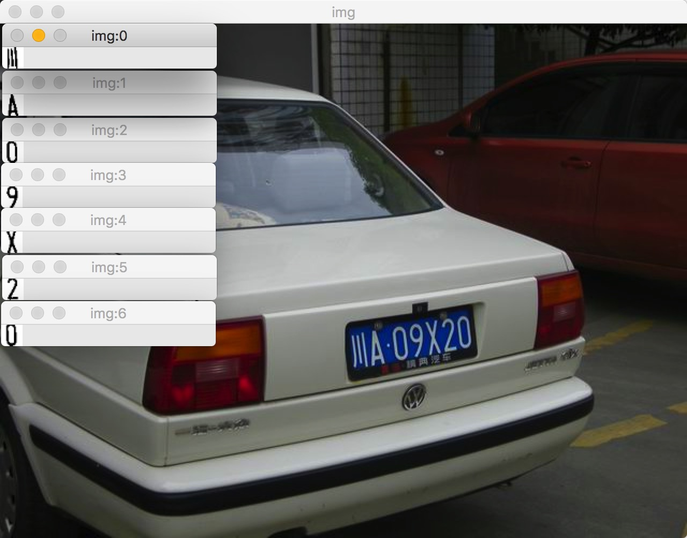
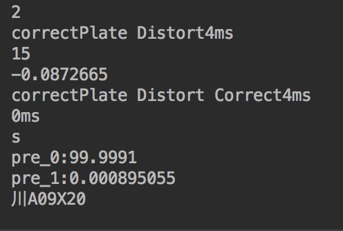
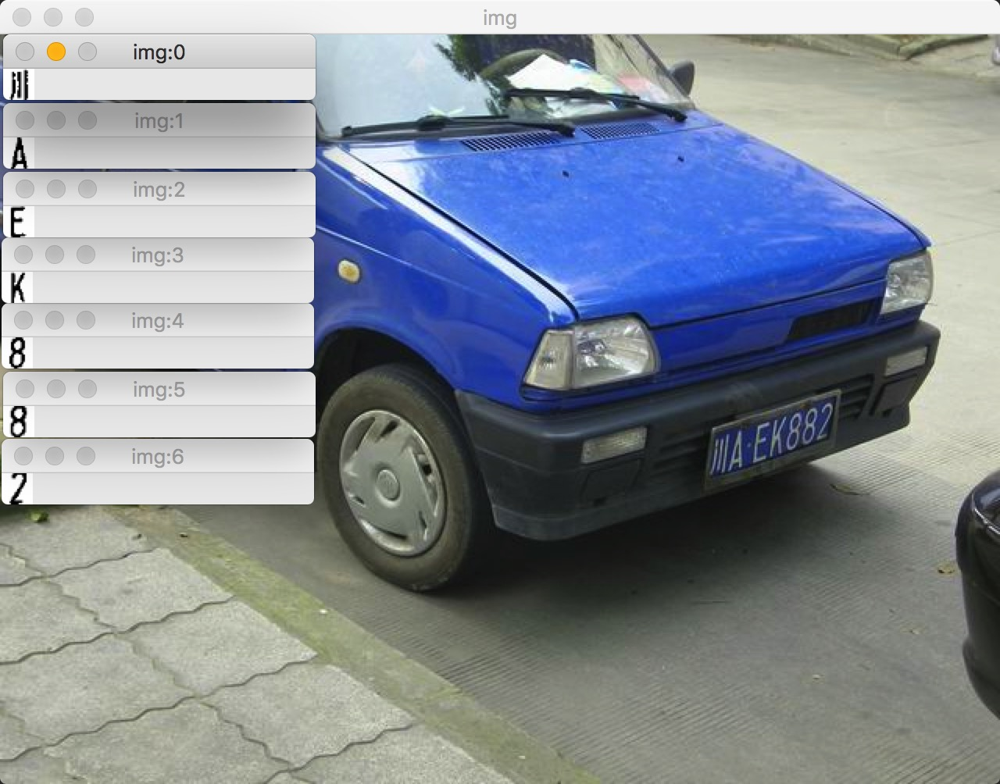
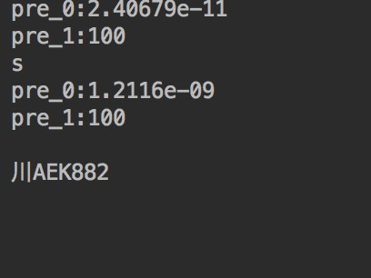

# HyperLPR

基于深度学习的实时车牌识别项目
###特点：
+ 车牌定位，判断，识别模块之间相互独立，支持多种识别方式。可自由调配。
+ 支持基于深度学习的end-to-end端到端的识别，无需分割车牌字符。
+ 实时,目前一张识别速度在 40-50ms 左右，可对视频流进行实时识别。
+ 支持大角度车牌，倾斜车牌。
+ 前置图像增强。
+ 只包含头文件，使用方便。

###项目还在开发进行中...待完善。

###依赖:
+ OpenCV
+ tiny_cnn(已包含)
+ tbb（可选）

###测试使用方法:
将Hyperlpr目录移动至所需的项目目录，并且包含"hyperlpr.h"头文件即可。

###大角度样张测试:

###Anthor:
+ Jack Yu