# HyperLPR Alpha

基于深度学习的实时车牌识别项目,目前还在开发过程中。
### 特点(已实现和待实现)：
*******************

- [x] 车牌定位，判断，识别模块之间相互独立，支持多种识别方式。可自由调配。
- [x] 实时,一张720p图像识别速度在 40-50ms 左右，可对视频流进行实时识别。
- [x] 支持大角度车牌，倾斜车牌。
- [x] 仅包含头文件，移植方便。
- [x] 使用卷积神经网络识别字符。
- [ ] 混淆字符处理。
- [ ] 前置图像增强。
- [ ] 支持基于深度学习的end-to-end端到端的识别，无需分割车牌字符。

### 依赖:
*************************
+ OpenCV
+ tiny_cnn(已包含)
+ TBB（可选）

### 测试使用方法:
**********************
将Hyperlpr目录移动至所需的项目目录，并且包含"hyperlpr.h"头文件即可。

### 样张测试（数据来源于EasyPR测试集）:
******************
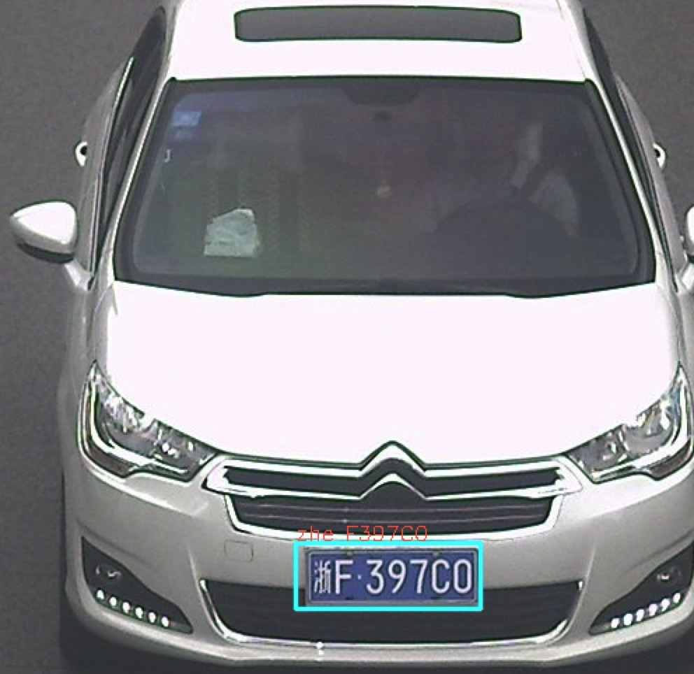
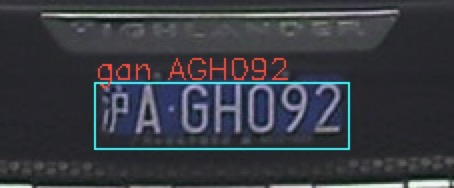
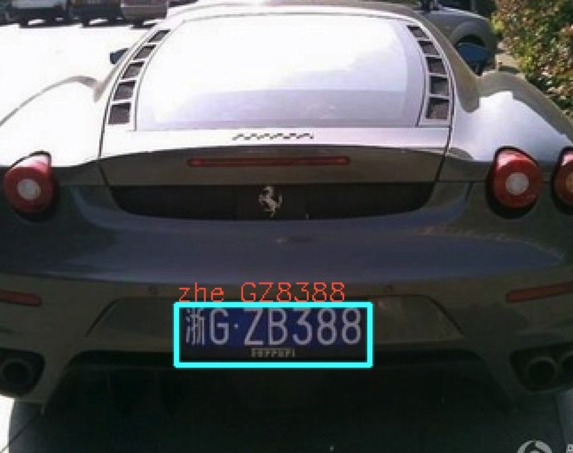
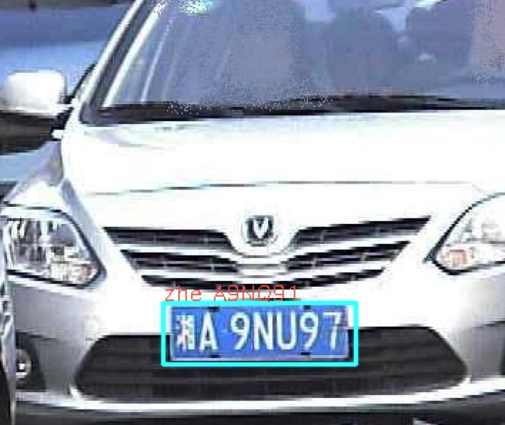
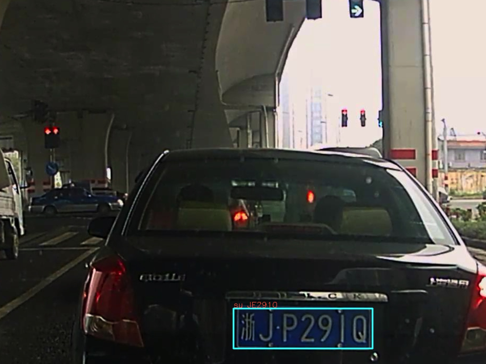
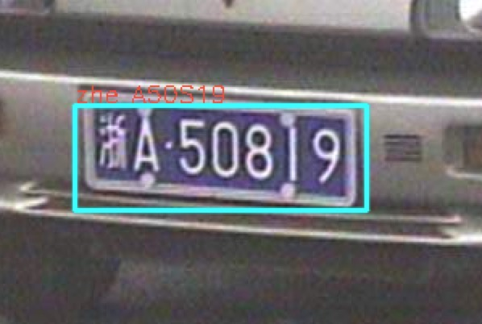
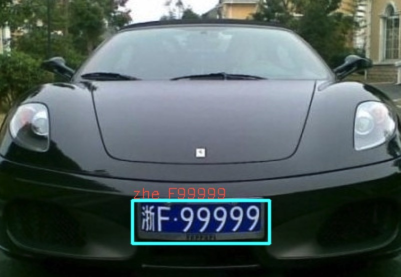
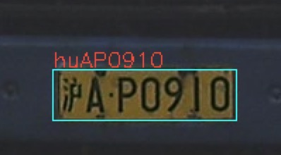
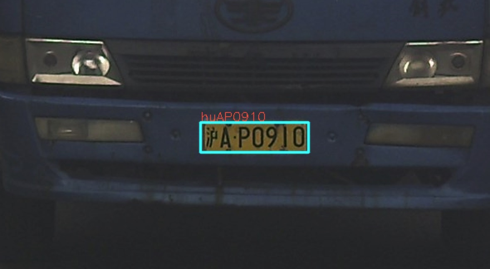

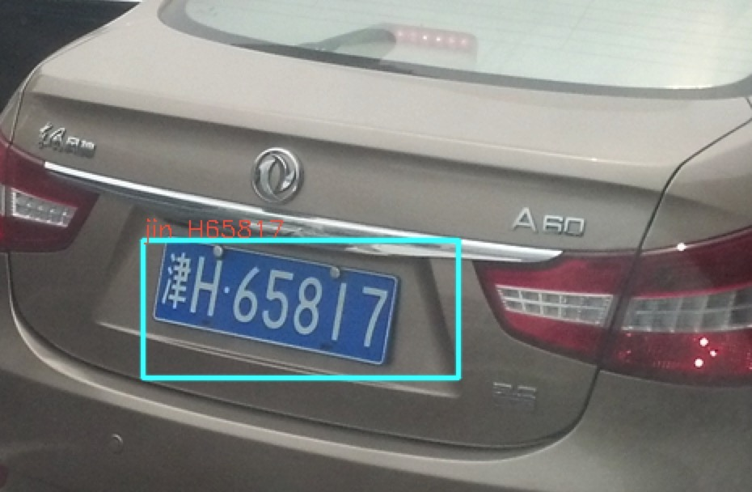
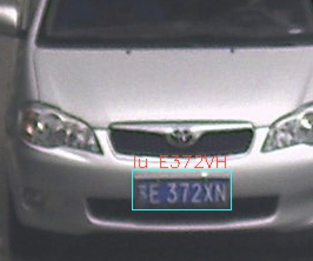
### Anthor:
********************
+ Jack Yu
